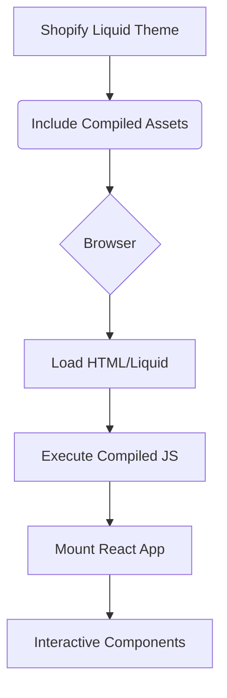
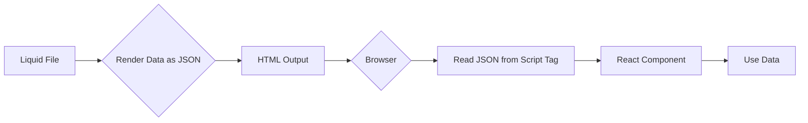
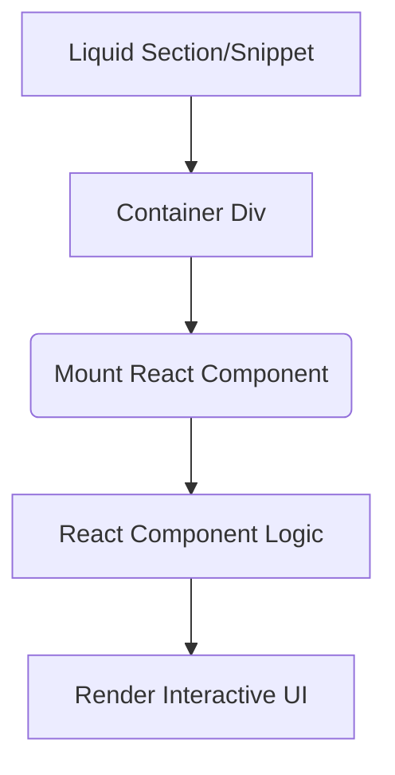

# Migrating Shopify Liquid to React/TypeScript/Vite

This document outlines the process and considerations for migrating parts of a Shopify theme from Liquid to a modern frontend stack using React, TypeScript, and Vite.

## Feasibility and Benefits

Migrating parts of a Shopify theme to React/TypeScript/Vite is entirely feasible and offers significant advantages:

*   **Improved Developer Experience:** Leverage modern tooling, hot module replacement, and strong typing.
*   **Component Reusability:** Build reusable UI elements for better maintainability and scalability.
*   **Enhanced Performance:** Potential performance improvements through client-side rendering and optimized asset bundling.
*   **Easier State Management:** Manage complex UI states effectively with React's state management capabilities.
*   **Access to Modern Tooling:** Utilize a vast ecosystem of modern frontend tools.

## Challenges

Consider the following challenges during the migration:

*   **Integration Complexity:** Integrating a client-side framework into a server-rendered Liquid environment requires careful planning.
*   **Shopify's Rendering Pipeline:** Understanding how Liquid and client-side React interact is crucial.
*   **Data Fetching:** Determine how React components will fetch data (Storefront API, AJAX, Liquid).
*   **Build Process:** Set up a Vite build process to compile assets for inclusion in the theme.
*   **Learning Curve:** Developers new to React, TypeScript, or Vite will have a learning curve.

## Usual Migration Process

Here is a typical process for migrating parts of a Shopify theme:

1.  **Identify Components for Migration:**
    *   Start with interactive elements, complex forms, or dynamic sections.
    *   Examples: Product variant selectors, mini-carts, search interfaces, filtering UIs.

2.  **Set up a Modern Frontend Development Environment:**
    *   Initialize a Node.js project within your theme or a dedicated `frontend` directory.
    *   Install React, TypeScript, and Vite.
    *   Configure Vite for building theme-compatible assets.

3.  **Create React Components:**
    *   Build self-contained, reusable components in React and TypeScript.

4.  **Integrate React into Liquid:**
    *   Create a container element in your Liquid file (e.g., a `div`).
    *   Pass initial data from Liquid to the container (JSON script tag, data attributes).
    *   Include compiled JS/CSS assets using `asset_url`.

5.  **Mount the React Application:**
    *   In your main JS entry point, find the container and mount the React app using `ReactDOM.render()` or `createRoot().render()`.

6.  **Handle Data Fetching (if needed):**
    *   Use `fetch` or Axios for API calls (Shopify Storefront API, AJAX API).

7.  **Refactor and Iterate:**
    *   Gradually replace Liquid/imperative JS with React components.
    *   Test thoroughly.

8.  **Optimize and Deploy:**
    *   Optimize for production.
    *   Deploy the updated theme.

## Visualizing the Process

Here are some Mermaid diagrams to illustrate the integration:

### High-Level Overview

### Data Flow Example (Passing data from Liquid to React)

### Component Integration Example

## Helpful Resources

Here are some online resources that can assist with the migration process:

*   **Volt: A Vite plugin for Shopify development:** [https://shopify-vite.barrelny.com/guide/](https://shopify-vite.barrelny.com/guide/)
*   **GitHub - barrel/shopify-vite:** [https://github.com/barrel/shopify-vite](https://github.com/barrel/shopify-vite)
*   **How to setup Shopify Vite with Tailwind CSS:** [https://dev.to/prashant-ardeshana/how-to-setup-shopify-vite-with-tailwind-css-3fga](https://dev.to/prashant-ardeshana/how-to-setup-shopify-vite-with-tailwind-css-3fga)
*   **Best-in-Class Developer Experience with Vite and Hydrogen (Shopify Engineering Blog):** [https://shopify.engineering/developer-experience-with-hydrogen-and-vite](https://shopify.engineering/developer-experience-with-hydrogen-and-vite)
*   **vite-plugin-shopify (npm):** [https://www.npmjs.com/package/vite-plugin-shopify](https://www.npmjs.com/package/vite-plugin-shopify)

This document provides a starting point for understanding and planning your migration from Shopify Liquid to a React/TypeScript/Vite stack.